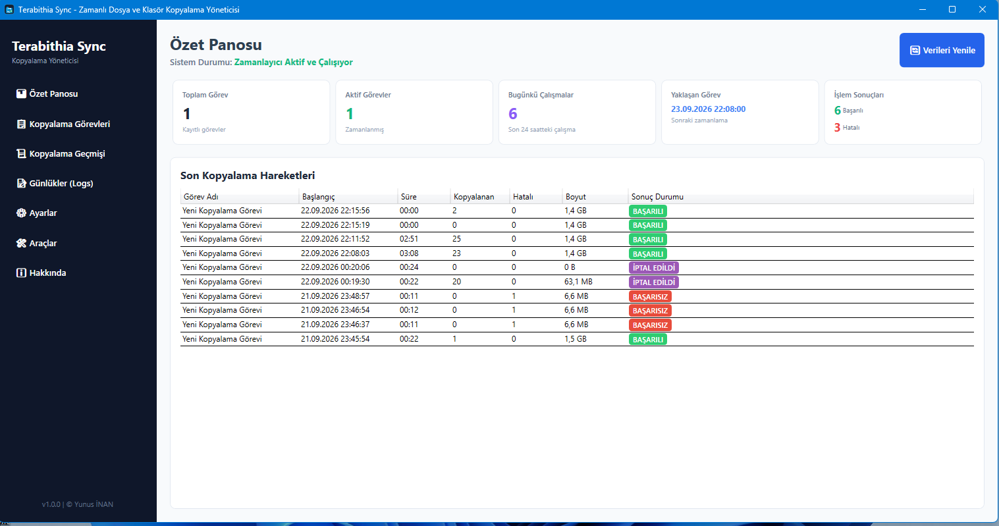
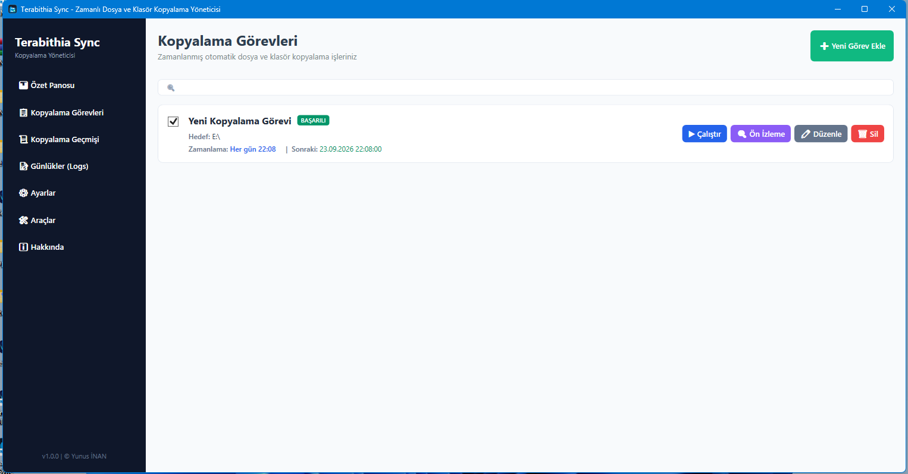
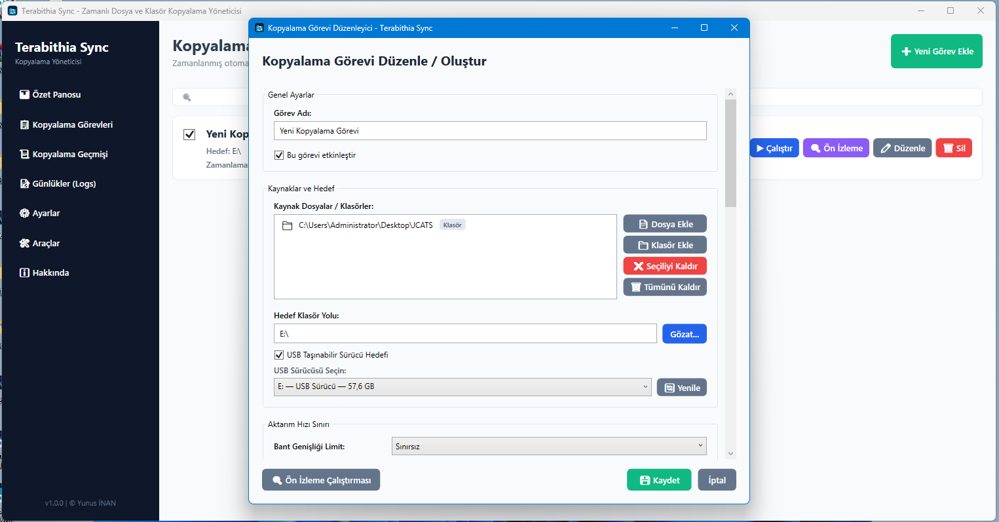
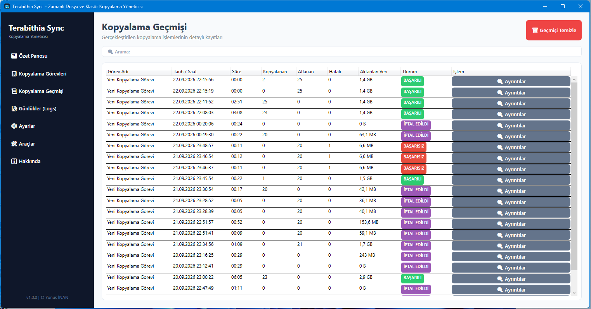
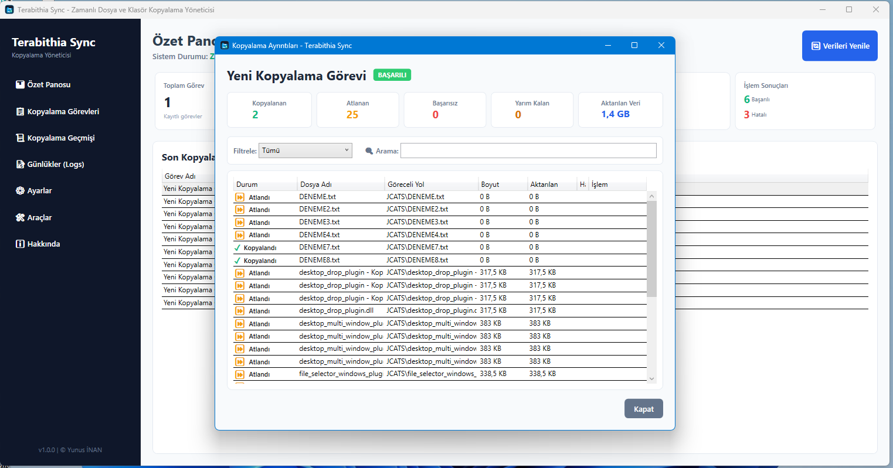
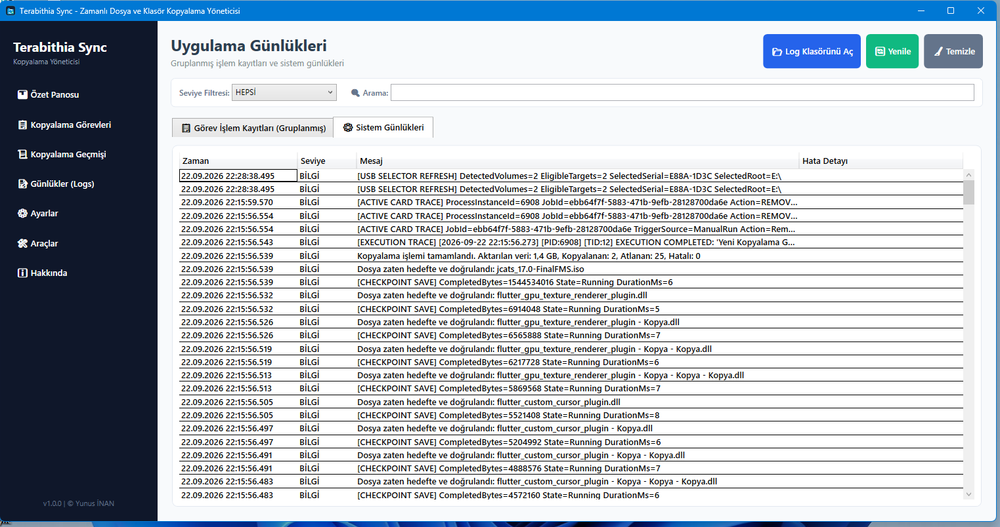
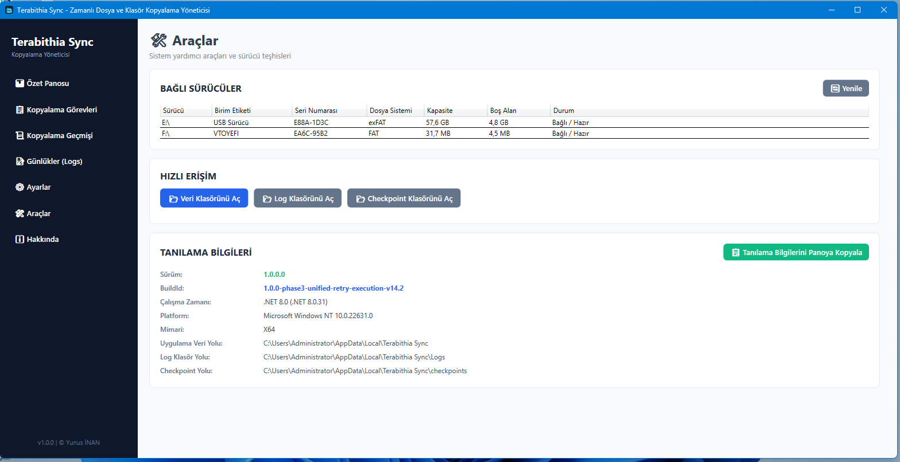
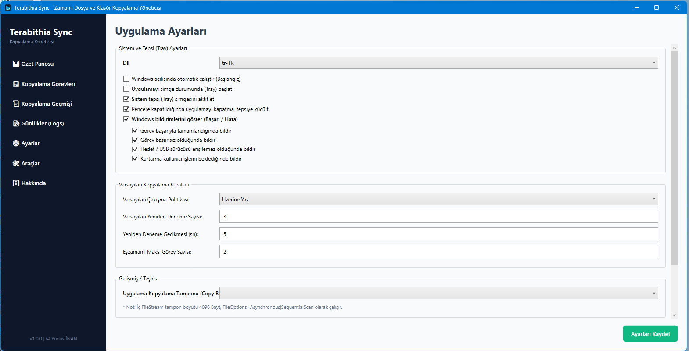

# Terabithia Sync

**Windows için Zamanlanmış, Güvenli ve Kesintiye Dayanıklı Dosya/Klasör Kopyalama ve Yedekleme Yöneticisi**

[](https://github.com/Terabithia1572/Terabithia-Sync/actions/workflows/build.yml)
[](https://dotnet.microsoft.com/)
[](https://www.microsoft.com/windows)
[](https://docs.microsoft.com/en-us/dotnet/csharp/)
[](LICENSE)
[](https://github.com/Terabithia1572/Terabithia-Sync/releases)

---

## Proje Hakkında

**Terabithia Sync**, Windows işletim sistemleri için C# ve .NET 8 ile geliştirilmiş; zamanlanmış, artımlı ve kesintiye dayanıklı dosya ve klasör kopyalama yöneticisidir.

Geliştirici: **Yunus İNAN**  
GitHub: [@Terabithia1572](https://github.com/Terabithia1572)  
Kararlı Derleme Kimliği (BuildId): `1.0.0-phase3-unified-retry-execution-v14.2`

---

## Özellikler

- ⏰ **Gelişmiş Görev Zamanlama:**
  - Günlük (Daily), Haftalık (Weekly), Aylık (Monthly), Tek Seferlik (OneTime) ve Quartz.NET altyapısıyla özel Cron zamanlamaları.
  - İstenildiği an tek tıkla **Manuel Çalıştırma**.
- 🔄 **Esnek Kopyalama Modları:**
  - **Artımlı Kopyalama (Incremental):** Yalnızca yeni veya değişmiş dosyaları hedefe aktarır.
  - **Ayna Modu (Mirror):** Kaynağın birebir kopyasını oluşturur (opsiyonel fazla dosya silme korumasıyla).
  - **Yalnızca Doğrula (Verify-Only):** Kopyalama yapmadan kaynak ve hedef farklarını raporlar.
- ⚔️ **Çakışma Yönetim Politikaları:** Atla (Skip), Üzerine Yaz (Overwrite), Yeniden Adlandır (Rename).
- ⚡ **Canlı Aktarım İlerlemesi:** Aktarılan bayt, mevcut dosya adı, anlık transfer hızı, kalan süre (ETA) ve geçen süre takibi.
- ⏯️ **Esnek İşlem Kontrolleri:** Canlı işlem sırasında Duraklat (Pause), Durdur (Stop), İptal Et (Cancel) kontrolleri.
- 🛡️ **Kalıcı Kontrol Noktası Kurtarma (Persistent Checkpoints):**
  - Elektrik veya uygulama kesintilerinde kopyalama durumunu diskte saklama.
  - Tamamlanmış dosyaları otomatik doğrulayarak tekrar kopyalamama.
  - Uygulama yeniden başlatıldığında kullanıcıya **Kurtarma Banner'ı (Recovery Banner)** sunma ve manuel "Devam Et" onayıyla kurtarma.
- 🔌 **Akıllı USB ve Taşınabilir Sürücü Güvenliği:**
  - Windows Birim Seri Numarası (Volume Serial Identity) ile USB sürücülerini tanıma.
  - USB takılıp çıkarıldığında otomatik algılama ve canlı oturumda otomatik devam ettirme.
  - Sürücü harfi değişse bile doğru USB birimini tespit etme, yanlış cihaza yazmayı engelleme.
  - Sürücü bağlı değilse hedef erişilebilir olana kadar otomatik bekleme.
  - Görev Düzenleyicide doğrudan USB birimi seçici (USB Target Selector).
- 📜 **Ayrıntılı İşlem Geçmişi ve Günlükleme:**
  - Dosya düzeyinde ayrıntılı kopyalama geçmişi.
  - **Merkezi Yeniden Deneme (Centralized Retry Pipeline):** Başarısız olan veya seçilen dosyaları tek tıkla yeniden deneme.
  - Aynı görevin eşzamanlı çalışmasını önleyen çifte çalıştırma koruması (Duplicate execution protection).
- 🔔 **Sistem Entegrasyonları:**
  - Windows Toast bildirimleri (Başarı/Hata/Kurtarma durumları).
  - Sistem Tepsisi (System Tray) desteği ve simge durumunda çalıştırma.
  - Windows başlangıcında otomatik çalışma opsiyonu.
  - Türkçe ve İngilizce dil (Localization) desteği.
  - Sistem Teşhis ve Araçlar sayfası (Tools Page).

> [!NOTE]
> **Kesinti Kurtarma Notu:** Kalıcı kontrol noktaları (Checkpoint) sayesinde tamamlanmış dosyalar tekrar kopyalanmaz. Ancak yarıda kalan büyük tek bir dosya, kurtarma başlatıldığında 0. bayttan itibaren tekrar yazılır (bayt düzeyinde parça devamı sonraki sürümler için planlanmıştır).

---

## Ekran Görüntüleri

<table>
<tr>
<td width="50%">

<br><b>Özet Panosu (Dashboard)</b>
</td>
<td width="50%">

<br><b>Kopyalama Görevleri (Copy Jobs)</b>
</td>
</tr>
<tr>
<td width="50%">

<br><b>Görev Düzenleyici & USB Hedef Seçici</b>
</td>
<td width="50%">

<br><b>Kopyalama Geçmişi (Copy History)</b>
</td>
</tr>
<tr>
<td width="50%">

<br><b>Dosya Düzeyinde Geçmiş Ayrıntıları</b>
</td>
<td width="50%">

<br><b>Uygulama Günlükleri (Grouped Logs)</b>
</td>
</tr>
<tr>
<td width="50%">

<br><b>Sistem Günlükleri (System Logs)</b>
</td>
<td width="50%">

<br><b>Araçlar & USB Sürücü Teşhisi (Tools)</b>
</td>
</tr>
<tr>
<td width="50%">

<br><b>Uygulama Ayarları (Settings)</b>
</td>
<td width="50%">

<br><b>Hakkında (About)</b>
</td>
</tr>
</table>

---

## Mimari

Proje, Clean Architecture ve MVVM desenine uygun 5 katmandan oluşmaktadır:

```
ScheduledCopyManager.slnx
├── ScheduledCopyManager.App/          -> WPF Kullanıcı Arayüzü, Uygulama Başlatıcı (Bootstrapper)
├── ScheduledCopyManager.Domain/       -> Temel veri modelleri, iş kuralları ve arabirimler
├── ScheduledCopyManager.Infrastructure/ -> Kopyalama motoru, Quartz zamanlayıcı, USB servisleri ve Serilog
├── ScheduledCopyManager.Presentation/ -> MVVM ViewModels, Görünüm Mantığı ve Diyalog Servisleri
└── ScheduledCopyManager.Tests/        -> Unit ve Regresyon Testleri
```

### Kullanılan Teknolojiler
- **Masaüstü Altyapısı:** WPF / .NET 8.0 (win-x64)
- **MVVM Framework:** `CommunityToolkit.Mvvm`
- **Zamanlayıcı Altyapısı:** `Quartz.NET`
- **Günlükleme (Logging):** `Serilog` (Dosya ve UI log akışı)
- **Veri Depolama:** `System.Text.Json` (Ayarlar, Görevler, Geçmiş ve Kontrol Noktaları)
- **Bildirimler:** Windows Toast Notifications & System Tray Entegrasyonu

---

## Kesinti ve Kurtarma Davranışı

Terabithia Sync, kopyalama sırasında oluşabilecek kesintilere karşı veri güvenliğini garanti eder:

1. **Durum Kaydı (Checkpointing):** Kopyalama sırasında aktarılan dosya durumları periyodik olarak diske yazılır.
2. **Doğrulama ve Atlama:** Kurtarma işleminde daha önce başarıyla tamamlanan dosyalar tekrar kopyalanmaz.
3. **Güvenli Otomatik Yeniden Başlatmama:** Uygulama veya bilgisayar aniden kapandığında, uygulama yeniden açıldığında kopyalama **otomatik başlamaz**. Arayüzde bir **Kurtarma Banner'ı** belirir ve kullanıcının "Devam Et" butonuna basması beklenir.
4. **USB Otomatik Devam Etme:** Canlı kopyalama sırasında USB bellek çıkarılırsa görev duraklatılır ve bellek tekrar takıldığında yapılandırılan politikaya göre otomatik devam eder.
5. **Aynı İşe Ait Çifte Çalıştırma Engeli:** Aynı görevin veya geçmişten yeniden denemenin çakışmasını önlemek için merkezi kilit mekanizması kullanılır.

---

## USB Hedef Güvenliği

- Terabithia Sync, çıkarılabilir USB sürücüleri tanımlarken Windows Birim Seri Numarasını (Volume Serial identity) kaydeder.
- Sürücü harfi değişse bile (örneğin `E:` yerine `F:` olduğunda), uygulama seri numarasından USB diski otomatik tespit eder.
- Başka bir USB diski eski sürücü harfini aldığında, uygulama yanlış diske kopyalama yapmaz ve işlemi durdurur.

---

## Kurulum

Resmi hazır kurulum paketleri [GitHub Releases](https://github.com/Terabithia1572/Terabithia-Sync/releases) sayfasında sunulmaktadır.

Kurulum paketi **bağımsız (self-contained win-x64)** olarak paketlendiği için kullanıcının bilgisayarına ayrıca .NET Desktop Runtime yüklemesine gerek yoktur.

---

## Geliştirme ve Derleme

### Gereksinimler
- Windows 10 / 11 x64
- .NET 8.0 SDK
- Visual Studio 2022 (v17.8+) veya uyumlu C# geliştirme ortamı

### Derleme Komutları
```powershell
# Geri yükleme
dotnet restore

# Derleme
dotnet build -c Release

# Testleri çalıştırma (Benchmark hariç regresyon paketi)
dotnet test ScheduledCopyManager.Tests\ScheduledCopyManager.Tests.csproj -c Release --filter "FullyQualifiedName!~Benchmark"
```

---

## Sürüm ve Durum

- **Uygulama Sürümü:** `1.0.0`
- **Kararlı Derleme Kimliği (BuildId):** `1.0.0-phase3-unified-retry-execution-v14.2`
- **Durum:** Phase 3 Kararlı (Actively Tested)

---

## English Summary

**Terabithia Sync** is a robust, scheduled, incremental file and folder copy manager for Windows built with C# and .NET 8.

### Key Features
- **Flexible Scheduling:** Daily, weekly, monthly, one-time, and custom Quartz.NET Cron schedules.
- **Copy Modes:** Incremental (copies updated files), Mirror (exact source replica), and Verify-Only.
- **Conflict Handling:** Skip, Overwrite, or Rename files.
- **Persistent Checkpoint Recovery:** Interrupted copy sessions persist progress; completed files are verified and skipped upon user resume.
- **USB Target Safety:** Volume Serial Identity matching resolves drive-letter shifts and prevents writing to incorrect devices.
- **Centralized Retry Pipeline:** Granular file-level history tracking with single-click retry execution.
- **System Integration:** Windows Toast Notifications, System Tray support, Turkish & English localization, and diagnostic tools page.

---

## Lisans

Bu proje **Yunus İNAN** tarafından geliştirilmiştir ve çift dilli (Türkçe & MIT) lisans altında yayınlanmıştır. Ayrıntılar için [LICENSE](LICENSE) dosyasına bakabilirsiniz.

Copyright (c) 2026 Yunus İNAN. Tüm Hakları Saklıdır.
