# Terabithia Sync

**Zamanlı Dosya ve Klasör Kopyalama Yöneticisi**

[](https://github.com/YunusInan/Terabithia-Sync/actions/workflows/build.yml)
[](https://dotnet.microsoft.com/)
[](https://www.microsoft.com/windows)
[](https://docs.microsoft.com/en-us/dotnet/csharp/)
[](LICENSE)
[](https://github.com/YunusInan/Terabithia-Sync/releases)

---

## 1. Proje Hakkında

**Terabithia Sync**, Windows işletim sistemleri için geliştirilmiş, yüksek performanslı, güvenilir ve modüler bir zamanlı dosya/klasör kopyalama ve senkronizasyon yöneticisidir.

Günümüz bilgi teknolojileri altyapılarında kritik verilerin düzenli olarak yedeklenmesi ve farklı disk alanları veya sunucular arasında senkronize edilmesi yaşamsal bir gereksinimdir. **Terabithia Sync**, karmaşık komut satırı araçları veya güvenilmez yedekleme yazılımları yerine; modern WPF arayüzü, gelişmiş görev zamanlayıcısı, otomatik USB ve ağ sürücüsü algılama mekanizmaları ile eksiksiz bir çözüm sunar.

### Çözüm Sunulan Problemler ve Kullanım Alanları:
- **Otomatik ve Zamanlanmış Yedeklemeler:** Günlük, haftalık, aylık veya özel cron zamanlamalarıyla personel müdahalesine gerek kalmadan verilerin yedeklenmesi.
- **Sunucu ve İstemci Dosya Senkronizasyonu:** Ağ paylaşımları (UNC yolları) ve yerel diskler arasında artımlı veya ayna modunda kesintisiz senkronizasyon.
- **Taşınabilir USB Sürücü Yedeklemesi:** USB disk bilgisayara takıldığı anda hedefin varlığını otomatik algılayarak bekleyen yedekleme görevlerini başlatma.
- **Kilitli ve Erişim Engelli Dosya Toleransı:** Başka işlemler tarafından kullanılan (kilitli) dosyalar nedeniyle tüm görevin başarısız olmasını önleme; hatalı dosyaları ayrı izleme ve bağlantı sağlandığında **yalnızca başarısız olanları yeniden deneme** (Resume/Retry) yeteneği.
- **Veri Kaybı Önleme:** Ayna modu silme izinlerinde açık onay mekanizması ve hedef klasörün kaynak klasörün içine konumlandırılmasını engelleyen dairesel kopyalama doğrulaması.

---

## 2. Özellikler

- ⏰ **Gelişmiş Görev Zamanlama:**
  - **Günlük (Daily):** Belirlenen saat ve dakikada her gün otomatik çalışma.
  - **Haftalık (Weekly):** Haftanın seçilen günlerinde zamanlanmış yürütme.
  - **Aylık (Monthly):** Ayın belirlenen gününde otomatik tetiklenme.
  - **Tek Seferlik (OneTime):** Belirtilen tarih ve saatte tek seferlik çalışma.
  - **Özel Cron:** Quartz.NET altyapısıyla gelişmiş cron ifadeleri desteği.
- 🚀 **Esnek Çalıştırma Seçenekleri:** Zamanlanmış görevlerin yanı sıra istenildiği an **Manuel Çalıştırma** ve önceden sonuçları simüle eden **Ön İzleme (Dry Run)** modu.
- 🔄 **Üç Farklı Kopyalama Modu:**
  - **Artımlı (Incremental):** Yalnızca yeni veya değişmiş dosyaları kopyalar.
  - **Ayna Modu (Mirror):** Kaynağın birebir kopyasını hedefte oluşturur (opsiyonel fazla dosya silme izniyle).
  - **Yalnızca Doğrula (Verify-Only):** Dosyaları aktarmadan kaynak ve hedef arasındaki farkları raporlar.
- ⚔️ **Esnek Çakışma Politikaları (Conflict Handling):**
  - **Atla (Skip):** Hedefte aynı dosya varsa kopyalamayı atlar.
  - **Üzerine Yaz (Overwrite):** Kaynak dosya ile hedef dosyayı değiştirir.
  - **Yeniden Adlandır (Rename):** Hedefteki dosyayı bozmadan `dosya (1).ext` biçiminde kaydeder.
- 🔌 **USB ve Çıkarılabilir Sürücü Algılama:**
  - Taşınabilir sürücülerin takılmasını/çıkarılmasını anlık izleme.
  - USB çıkarıldığında kopyalamayı güvenle bekletme, yeniden bağlandığında kalınan yerden **otomatik devam ettirme (Resume)**.
- 📊 **Gruplanmış ve Hiyerarşik Günlükleme (Grouped Logging):**
  - Tüm dosya işlemlerini klasör ve görev bazında daraltılabilir/genişletilebilir (`▶` / `▼`) hiyerarşide gösterme.
  - UI performansını koruyan Sanallaştırılmış (Virtualized) DataGrid yapısı.
- 🔁 **Başarısız Dosyaları Yeniden Deneme (Granular Resume):**
  - Görev kısmi başarılı veya başarısız tamamlandığında **tüm görevi baştan çalıştırmadan** yalnızca kilitli/başarısız olan dosyaları yeniden deneme.
- 🛡️ **Klasör Kök Yapısı Koruması:**
  - Kaynak olarak seçilen `C:\Yedek\Proje` klasörünün kendisini hedefte `E:\Hedek\Proje` olarak koruyarak kopyalama.
- 🔔 **Sistem Tepsisi (System Tray) ve Bildirimler:**
  - Windows başlangıcında sistem tepside sessiz çalışma, canlı durum simgesi ve Windows Toast bildirimleri.
- 🌐 **%100 Türkçe Kullanıcı Arayüzü ve Hata Çevirileri:**
  - Kullanıcıya sunulan tüm arayüz metinleri, durum etiketleri ve Windows I/O hata açıklamaları anlaşılır Türkçedir.

---

## 3. Ekran Görüntüleri

### Ana Panel (Dashboard)
Uygulama genel durum özeti, zamanlanmış görevlerin durumu ve hızlı istatistikler.
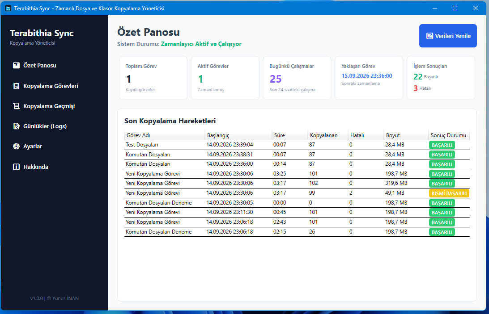

### Görev Yönetimi (Job Management)
Tüm zamanlanmış ve manuel kopyalama görevlerinin listelendiği ana yönetim ekranı.
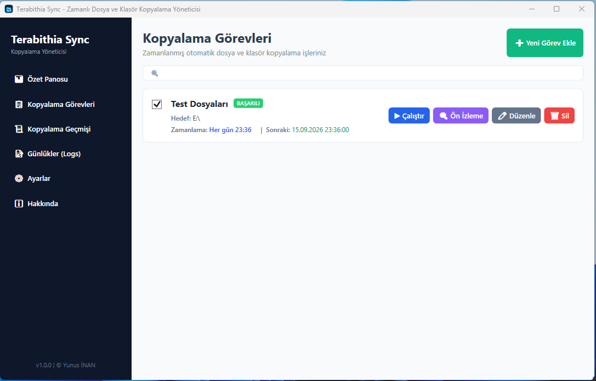

### Görev Düzenleyici ve Kaynak Yönetimi (Job Editor & Source Management)
Toplu dosya/klasör ekleme, multi-select kaldırma, çakışma politikası ve zamanlama ayarları.
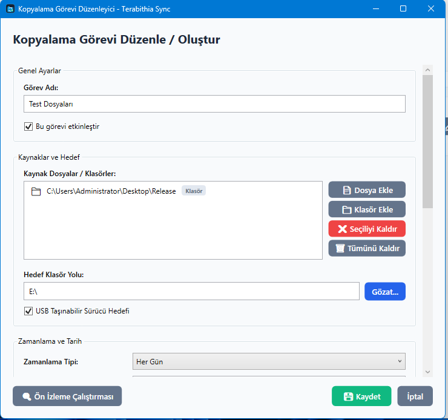
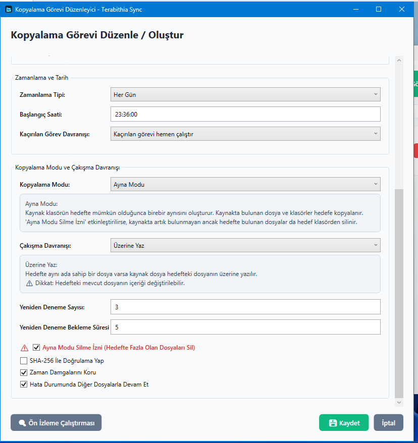

### Kopyalama Geçmişi ve Detaylı İnceleme (History & Granular Failure Retry)
Geçmiş çalıştırmalar, klasör bazlı başarı/hata dağılımı ve başarısız dosyaları tek tıkla yeniden deneme.
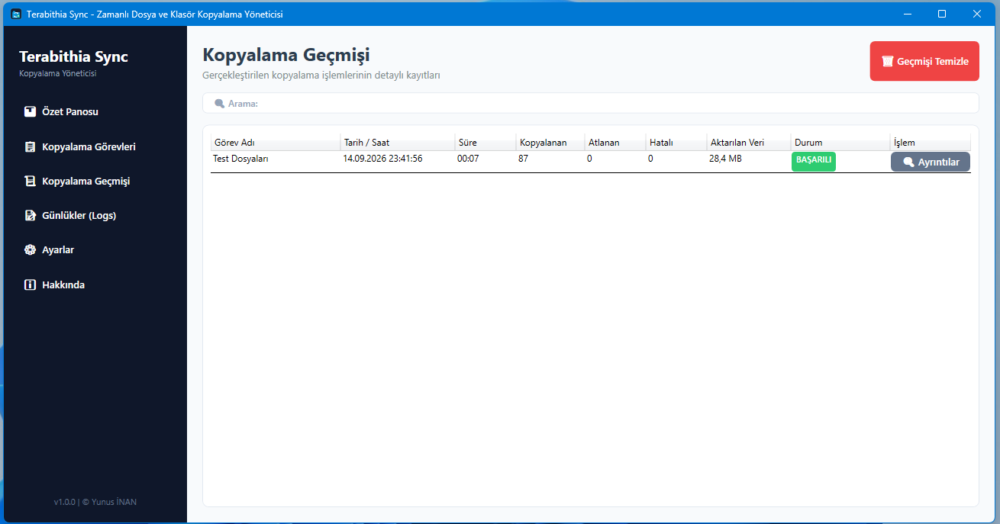
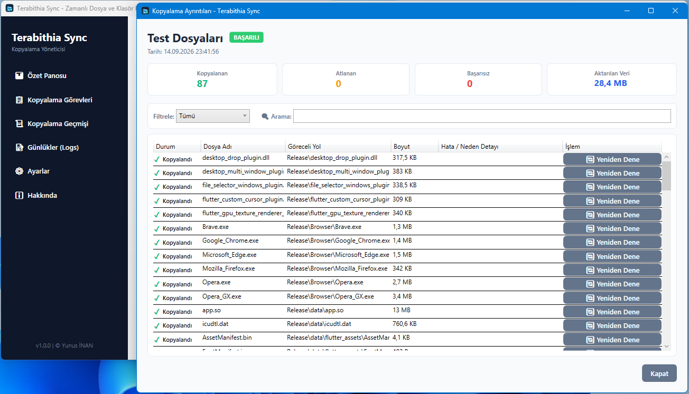

### Gruplanmış Günlükler (Hierarchical Grouped Logs)
Arayüzü yormayan hiyerarşik ağaç yapısında detaylı dosya işlem günlükleri.
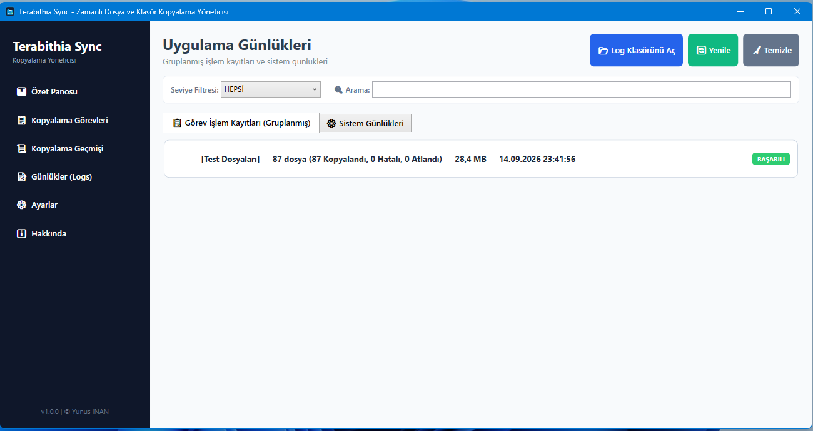

### Ayarlar ve Hakkında (Settings & About)
Otomatik başlatma, sistem tepsisi tercihleri, lisans ve sürüm bilgileri.

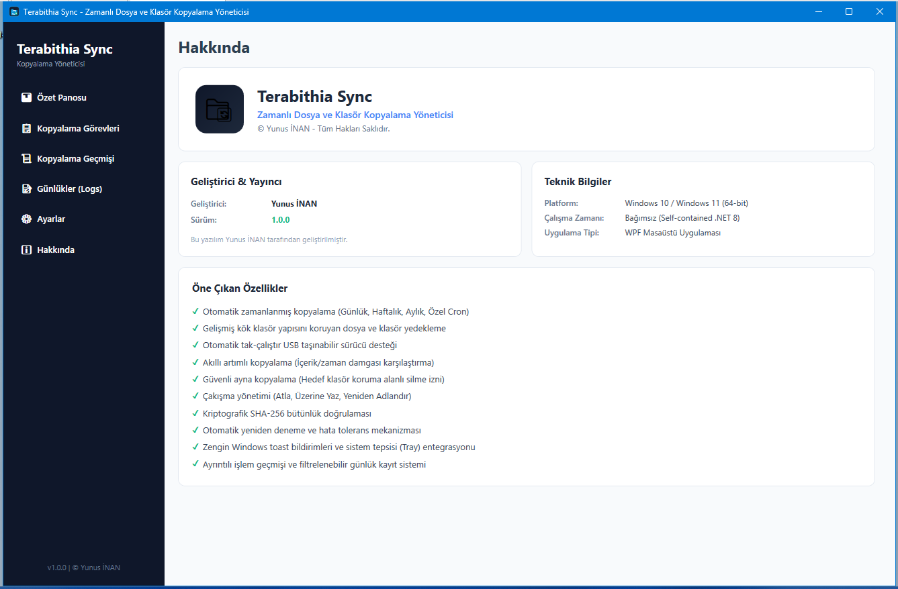

### Kurulum Sihirbazı (Installer)
Tek tıkla kurulum, Türkçe dil seçimi ve masaüstü/başlat menüsü kısayol entegrasyonu.
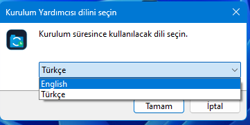
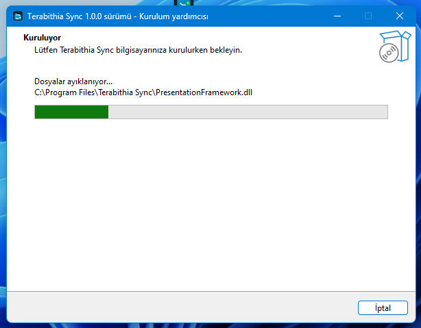
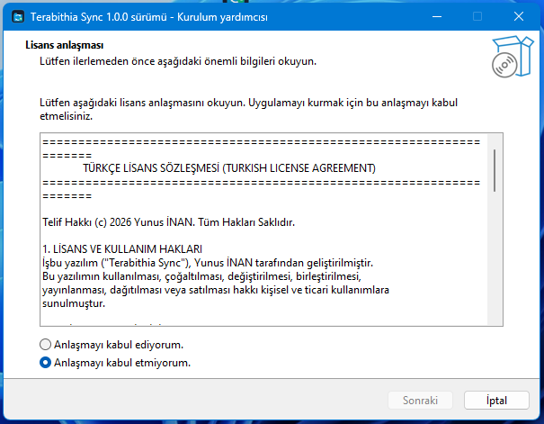
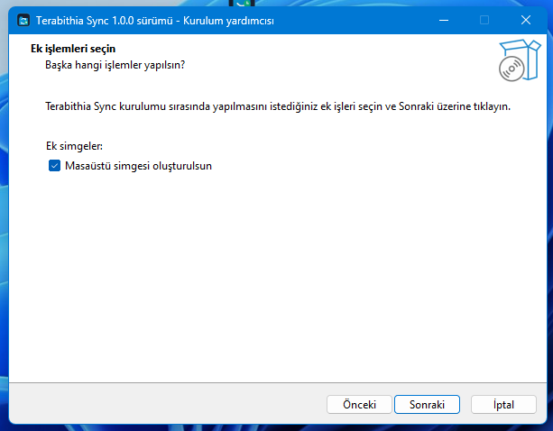

---

## 4. Nasıl Çalışır?

Terabithia Sync, katmanlı bir mimari üzerinde olay odaklı (event-driven) ve zamanlayıcı tabanlı olarak çalışır:

```
[ Kullanıcı Arayüzü (WPF / Presentation) ]
                  │
                  ▼
[ Görev Yöneticisi & Doğrulama (Application / Services) ]
                  │
        ┌─────────┴─────────┐
        ▼                   ▼
[ Quartz.NET Scheduler ]  [ Manuel Tetikleme ]
        │                   │
        └─────────┬─────────┘
                  ▼
   [ Kopyalama Motoru (FileCopyService) ]
                  │
     ┌────────────┼────────────┐
     ▼            ▼            ▼
[Dosya Doğrula] [İşlem Yap] [Ağ/USB Kontrol]
     │            │            │
     └────────────┼────────────┘
                  ▼
  [ Sonuç Kaydı & Günlükleme (Serilog & SQLite/JSON) ]
                  │
                  ▼
[ Windows Bildirimleri & Sistem Tepsisi Entegrasyonu ]
```

1. **Görev Tanımlama:** Kullanıcı UI üzerinden kaynak yolları, hedef yolu, zamanlama ve kopyalama modunu belirler. PathValidator yolların geçerliliğini ve dairesel kopyalama riskini doğrular.
2. **Zamanlama & Tetikleme:** Quartz.NET arka plan servisi zamanı gelen görevi `CopyJobExecution` üzerinden tetikler.
3. **Kopyalama Yürütmesi:** `FileCopyService` kaynak klasör yapısını analiz eder, hedefteki dosyalarla timestamp ve boyut (opsiyonel SHA-256) karşılaştırması yapar.
4. **Hata & USB Yönetimi:** Kopyalama esnasında USB çıkarılırsa `UsbDriveService` olayı yakalar ve görevi beklemeye alır. Kilitli dosyalarda kullanıcı dostu Türkçe hata mesajı kaydedilir.
5. **Geçmiş & Günlük Kaydı:** Yapılan tüm işlemler `HistoryRepository` ve `Serilog` aracılığıyla kalıcı hale getirilir.

---

## 5. Kopyalama Modları

### 🔹 Artımlı Kopyalama (Incremental)
- **Tanım:** Kaynak klasördeki yalnızca yeni oluşturulmuş veya son değiştirilme tarihi/boyutu değişmiş dosyaları hedefe aktarır.
- **Hedef Koruma:** Hedef klasörde kaynakta bulunmayan dosyalar varsa bunlara **dokunmaz ve silmez**.
- **Kullanım Amacı:** Günlük rutin yedeklemeler için en hızlı ve güvenli moddur.

### 🔹 Ayna Modu (Mirror)
- **Tanım:** Kaynak klasörün birebir aynısını hedef konumda oluşturur.
- **Silme İzni:** Görev ayarlarında *"Ayna Modu Silme İzni"* açıkça etkinleştirilirse, hedefte olup kaynakta artık bulunmayan fazla dosyalar hedeften kaldırılır.
- **Güvenlik Uyarısı:** Veri kaybını önlemek için silme izni etkinleştirilirken kullanıcıdan açık onay alınır. Kaynak klasördeki dosyalar ASLA silinmez.

### 🔹 Yalnızca Doğrula (Verify-Only)
- **Tanım:** Gerçek bir dosya kopyalama veya silme işlemi yapmaz.
- **Raporlama:** Kaynak ve hedef arasındaki dosya varlığı, boyut ve tarih farklarını tarar ve rapor halinde sunar.

---

## 6. Çakışma Politika Davranışları

Hedef konumda aynı isimde bir dosya zaten mevcutsa uygulamanın izleyeceği strateji:

- **Atla (Skip):** Hedefteki mevcut dosyayı korur, kopyalama adımını atlar.
- **Üzerine Yaz (Overwrite):** Hedefteki dosyayı yeni kaynak dosya içeriğiyle değiştirir.
- **Yeniden Adlandır (Rename):** Hedefteki dosyayı silmeden/değiştirmeden yeni dosyayı `dosya_adı (1).ext` formatında kaydeder.

---

## 7. USB ve Taşınabilir Sürücü Desteği

- **Otomatik Algılama:** Uygulama Windows `WM_DEVICECHANGE` sürücü olaylarını canlı olarak dinler.
- **USB Hedef Seçeneği:** Görev düzenleyicide *"Hedef bir USB Taşınabilir Sürücüdür"* seçilebilir.
- **Bağlantı Kesilmesi (Disconnect):** Kopyalama sırasında USB bellek çıkarılırsa görev iptal edilmez. İşlem `"USB sürücüsü çıkarıldı. Kopyalama bekletildi."` durumuna geçer.
- **Otomatik Devam Etme (Resume):** USB bellek tekrar takıldığında uygulama hedef sürücünün erişilebilir olduğunu doğrular ve kaldığı dosyadan **otomatik olarak kopyalamaya devam eder**.

---

## 8. Hata Yönetimi ve Türkçe Mesajlar

Windows işletim sisteminde dosya kopyalama sırasında oluşabilecek tüm teknik hatalar yakalanır ve kullanıcıya anlaşılır Türkçe terimlerle sunulur:

| Windows Hata Kodu / İstisna | Kullanıcıya Gösterilen Türkçe Mesaj |
| :--- | :--- |
| `IOException` (Sharing Violation / 0x80070020) | *"Dosya başka bir program veya kullanıcı tarafından kullanılıyor."* |
| `UnauthorizedAccessException` (0x80070005) | *"Dosyaya erişim izni bulunmuyor (Erişim reddedildi)."* |
| `FileNotFoundException` / `DirectoryNotFoundException` | *"Kaynak dosya veya klasör yolu bulunamadı."* |
| `PathTooLongException` | *"Dosya yolu Windows karakter sınırını aşıyor."* |
| `DriveNotFoundException` | *"Hedef sürücüye ulaşılamıyor veya sürücü bağlı değil."* |

---

## 9. Günlükler (Logs) ve Kopyalama Geçmişi (History)

Uygulama iki seviyeli izleme mekanizmasına sahiptir:

1. **Kopyalama Geçmişi (History):**
   - Her görevin çalışma zamanını, kopyalanan/atlanan/hatalı dosya sayılarını ve aktarılan toplam veri miktarını saklar.
   - Kısmi başarılı veya başarısız biten görevlerde **"Başarısızları Yeniden Dene"** butonunu sunar.

2. **Uygulama Günlükleri (Logs):**
   - Serilog altyapısı ile `%LOCALAPPDATA%\Terabithia Sync\Logs` klasörüne yazılır.
   - UI üzerinde ağaç hiyerarşisinde gruplanmış olarak sunulur.

---

## 10. Kullanılan Teknolojiler

- **Programlama Dili:** C# 12
- **Çalışma Zamanı (Runtime):** .NET 8.0 (Windows Desktop)
- **Mimarisi & UI:** WPF (Windows Presentation Foundation), XAML, MVVM Pattern
- **Bağımlılık Enjeksiyonu:** `Microsoft.Extensions.DependencyInjection`
- **Görev Zamanlayıcı:** `Quartz.NET 3.8+`
- **Loglama Altyapısı:** `Serilog`, `Serilog.Sinks.File`
- **Veri Serileştirme:** `System.Text.Json`
- **Test Framework:** `xUnit`, `Moq`
- **Paketleyici / Kurulum:** Inno Setup Compiler 6.x

---

## 11. Proje Mimarisi

Çözüm Clean Architecture ilkelerine uygun olarak 5 ana projeden oluşur:

```
ScheduledCopyManager.slnx
├── ScheduledCopyManager.Domain/         -> Temel iş kuralları, veri modelleri ve arabirimler (Interfaces)
├── ScheduledCopyManager.Infrastructure/ -> Kopyalama motoru, Quartz zamanlayıcı, USB servisleri ve depolama
├── ScheduledCopyManager.Presentation/   -> MVVM ViewModels, UI komutları ve diyalog servisleri
├── ScheduledCopyManager.App/            -> WPF XAML görünümleri, WPF konfigürasyonu ve giriş noktası (App.xaml)
└── ScheduledCopyManager.Tests/          -> xUnit birim testleri (Unit Tests)
```

---

## 12. Klasör Yapısı

```
Terabithia-Sync/
├── .github/
│   └── workflows/
│       └── build.yml                   # GitHub Actions CI Workflow
├── Assets/                             # Uygulama logosu ve ICO varlıkları
├── docs/
│   └── screenshots/                    # Ekran görüntüleri
├── Installer/
│   ├── TerabithiaSync.iss             # Inno Setup derleme senaryosu
│   └── Build-Installer.ps1            # Kurulum derleme PowerShell betiği
├── ScheduledCopyManager.App/           # WPF Uygulaması
│   ├── Views/                          # XAML Pencereleri ve Görünümler
│   ├── App.xaml / App.xaml.cs
│   └── TerabithiaSync.ico
├── ScheduledCopyManager.Domain/        # Domain Modelleri ve Arabirimler
├── ScheduledCopyManager.Infrastructure/# Kopyalama Motoru & Servisler
├── ScheduledCopyManager.Presentation/  # ViewModels ve UI Mantığı
├── ScheduledCopyManager.Tests/         # Birim Testleri
├── Directory.Build.props               # Ortak Derleme Ayarları
├── ScheduledCopyManager.slnx           # Solution Dosyası
├── LICENSE.txt / LICENSE               # Çift Dilli Lisans Sözleşmesi
├── README.md                           # Proje Dokümantasyonu
└── .gitignore                          # Git İstisna Kuralları
```

---

## 13. Kurulum ve Yayınlama

### Hazır Kurulum Dosyası (Installer)
1. [Releases](../../releases) sayfasından `TerabithiaSync-Setup-1.0.0.exe` dosyasını indirin.
2. Kurulumu çalıştırın ve ekrandaki yönergeleri izleyin.
3. Uygulama otomatik olarak masaüstü ve başlat menüsü kısayollarını oluşturacaktır.

### Bağımsız (Self-Contained) Yayınlama
Bilgisayarda .NET Runtime yüklü olmasına gerek kalmadan tek klasörlük bağımsız executable üretmek için:

```powershell
dotnet publish ScheduledCopyManager.App/ScheduledCopyManager.App.csproj -c Release -r win-x64 --self-contained true -o Release/TerabithiaSync
```

---

## 14. Kullanım Adımları

1. **Uygulamayı Başlatın:** Terabithia Sync simgesine tıklayarak uygulamayı açın.
2. **Yeni Görev Ekleyin:** Ana menüden **Kopyalama Görevleri** -> **Yeni Görev Ekle** butonuna basın.
3. **Kaynak ve Hedef Seçin:**
   - **Dosya Ekle** veya **Klasör Ekle** butonları ile kaynak yolları ekleyin.
   - **Hedef Klasör Yolu** alanından yedekleme yapılacak konumu seçin.
4. **Zamanlama ve Mod Ayarlayın:**
   - Zamanlama tipini seçin (örn. Her gün 23:00).
   - Kopyalama modunu (Artımlı, Ayna veya Yalnızca Doğrula) belirleyin.
   - Çakışma politikasını ayarlayın.
5. **Kaydedin ve Çalıştırın:** Görevi kaydedin. Dilerseniz listeden görevi seçip **"Şimdi Çalıştır"** butonuna basarak ilk yedeklemeyi başlatın.
6. **Geçmişi İnceleyin:** **Kopyalama Geçmişi** sekmesinden aktarılan dosya sayılarını ve detayları görün.

---

## 15. Örnek Kullanım Senaryoları

### Senaryo 1: Sunucu Klasöründen USB Diske Günlük Otomatik Yedekleme
- **Kaynak:** `\\192.168.1.100\Paylasim\Muhasebe`
- **Hedef:** `E:\Yedekler\Muhasebe` (USB Bellek)
- **Zamanlama:** Her Gün 18:30
- **Mod:** Artımlı Kopyalama (Incremental)
- **Sonuç:** Mesai bitiminde takılı olan USB belleğe yalnızca o gün değişen muhasebe evrakları otomatik aktarılır.

### Senaryo 2: Yerel Proje Klasörünün İkinci Diske Birebir Ayna Yedeklemesi
- **Kaynak:** `D:\Projeler`
- **Hedef:** `F:\Projeler_Ayna`
- **Zamanlama:** Her Hafta Cuma 22:00
- **Mod:** Ayna Modu (Mirror) + Silme İzni Etkin
- **Sonuç:** Silinen eski proje taslakları hedef diskte de temizlenerek F: diskinde kaynağın birebir kopyası tutulur.

---

## 16. Geliştirici Kurulumu (Developer Setup)

Projeyi yerel ortamınızda geliştirmek ve derlemek için:

### Gereksinimler:
- Windows 10/11 x64
- Visual Studio 2022 (v17.8+) veya Visual Studio Code (.NET C# Dev Kit ile)
- .NET 8.0 SDK

### Derleme Adımları:
```powershell
# 1. Depoyu klonlayın
git clone https://github.com/YunusInan/Terabithia-Sync.git
cd Terabithia-Sync

# 2. Bağımlılıkları geri yükleyin
dotnet restore ScheduledCopyManager.slnx

# 3. Projeyi derleyin
dotnet build ScheduledCopyManager.slnx -c Release

# 4. Testleri çalıştırın
dotnet test ScheduledCopyManager.slnx -c Release
```

---

## 17. Birim Testleri (Unit Tests)

Projeye ait iş kuralları `ScheduledCopyManager.Tests` altında xUnit ile test edilmektedir.

```powershell
dotnet test --configuration Release --nologo
```

### Test Edilen Ana Bileşenler:
- Çoklu kaynak dosya/klasör kaldırma ve yol normalleştirme (`SourceItemSelectionTests`)
- Türkçe Windows hata mesajı çevirileri (`UserFriendlyErrorTranslatorTests`)
- Artımlı ve ayna modu dosya kopyalama mantığı (`FileCopyServiceTests`)
- Yanlış veya eksik yol doğrulaması (`PathValidationTests`)
- Sadece başarısız dosyaları yeniden deneme mekanizması (`RetryFailedFilesTests`)

---

## 18. Inno Setup Kurulum Derlemesi

Inno Setup Compiler yüklü bir sistemde kurulum `.exe` dosyasını derlemek için hazırlanan betiği çalıştırabilirsiniz:

```powershell
powershell -ExecutionPolicy Bypass -File Installer/Build-Installer.ps1
```

Derleme sonucunda oluşturulan kurulum dosyası `Release/Installer/TerabithiaSync-Setup-1.0.0.exe` konumunda yer alır.

---

## 19. Lisans (License)

Bu proje **Yunus İNAN** tarafından geliştirilmiştir ve **Çift Dilli Lisans (MIT License)** altında yayınlanmaktadır.

Ayrıntılar için [LICENSE](LICENSE) dosyasına göz atabilirsiniz.

```
Telif Hakkı (c) 2026 Yunus İNAN. Tüm Hakları Saklıdır. / Copyright (c) 2026 Yunus İNAN. All Rights Reserved.
```

---

## 20. Katkıda Bulunma (Contributing)

Katkılarınız bizi mutlu eder! Hata bildirimleri, yeni özellik önerileri veya PR'lar için:

1. Projeyi Fork edin (`fork`).
2. Özellik dalınızı oluşturun (`git checkout -b ozellik/YeniOzellik`).
3. Değişikliklerinizi işleyin (`git commit -m 'Ekle: Yeni özellik'`).
4. Dalınıza push edin (`git push origin ozellik/YeniOzellik`).
5. Bir Pull Request (PR) açın.

---

## 21. Sorun Bildirme (Issue Reporting)

Herhangi bir hata veya beklenmeyen durum ile karşılaşırsanız lütfen [GitHub Issues](../../issues) sayfasından yeni bir sorun bildiriminde bulunun.

Bildiriminizde lütfen aşağıdaki bilgileri ekleyin:
- Windows Sürümü (örn. Windows 11 23H2)
- Hata Ekran Görüntüsü veya Günlük Metni (`%LOCALAPPDATA%\Terabithia Sync\Logs`)
- Adım adım hatanın nasıl ortaya çıktığı

---

## 22. Sürüm Notları (Release Notes)

### Sürüm 1.0.0 (İlk Kararlı Sürüm)
- ✨ İlk kararlı sürüm yayınlandı.
- 🎨 Modern WPF kullanıcı arayüzü ve %100 Türkçe yerelleştirme.
- ⏰ Quartz.NET entegrasyonlu zamanlanmış görev motoru.
- 🔌 USB otomatik algılama ve kopyalama devam ettirme (Resume) desteği.
- 📊 Gruplanmış hiyerarşik günlükler ve detaylı kopyalama geçmişi.
- 📦 Inno Setup ile tek tıkla Windows kurulum paketi.
